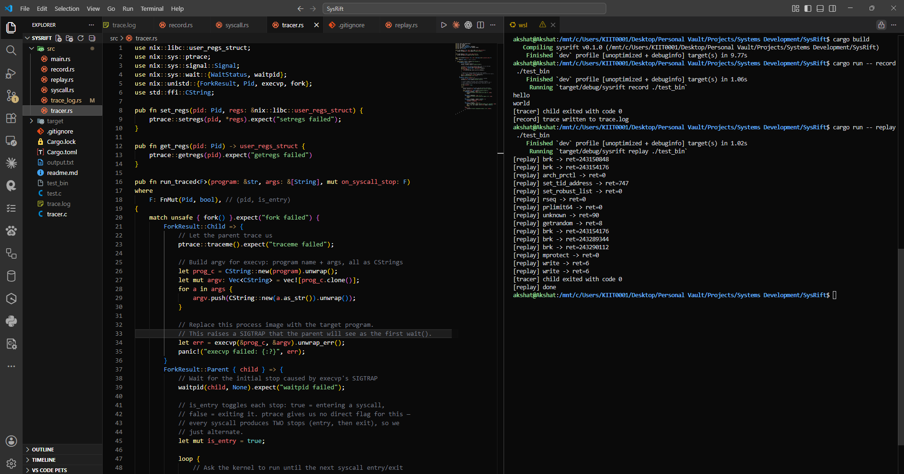
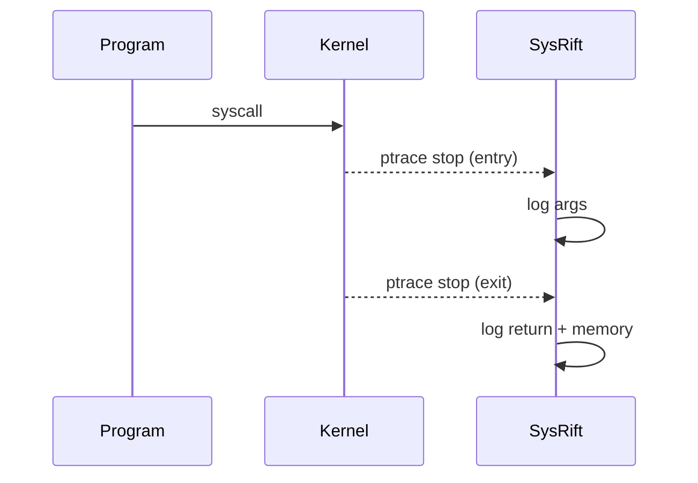
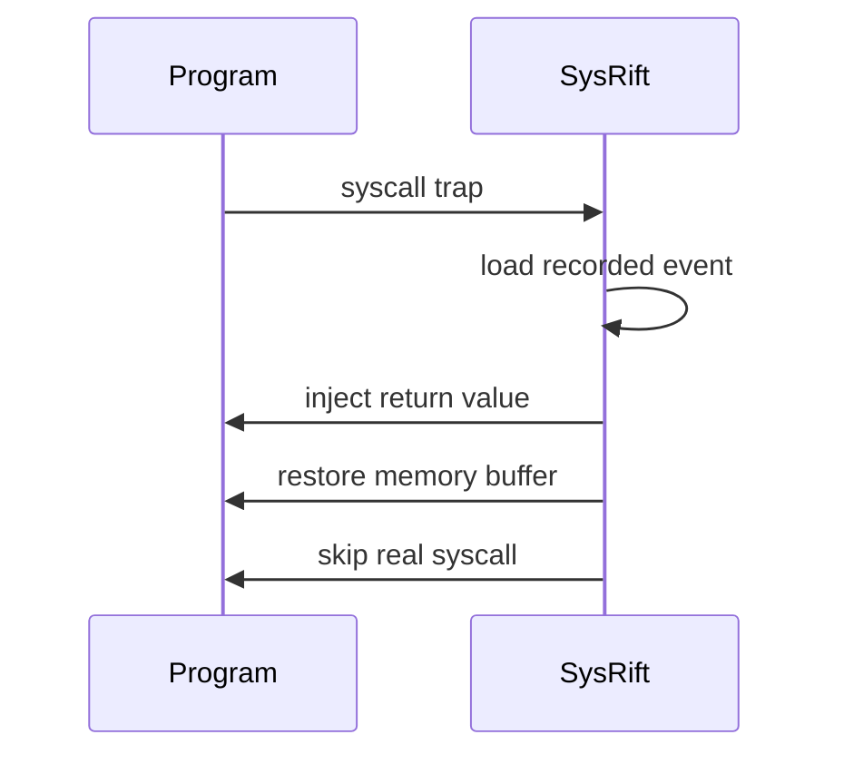
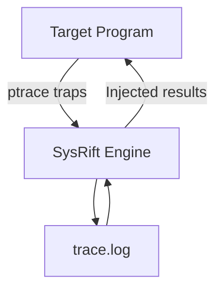
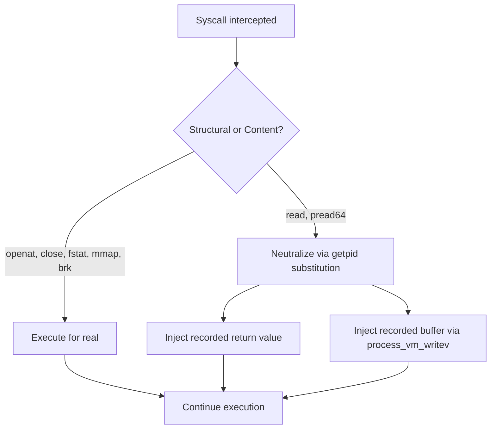

# SysRift- Deterministic Syscall-Level Execution Replay Engine

[](LICENSE)
[]()
[]()
[]()

---



## 🚀 Overview

**SysRift** is a low-level deterministic execution replay engine that records and replays Linux system calls using `ptrace`.

Instead of snapshotting full processes or virtualizing hardware, SysRift operates at the syscall boundary — capturing:

- syscall entry arguments
- syscall return values
- user memory buffers (e.g., `read()` data)

and re-injecting them during replay to reproduce program behavior deterministically.

This technique is inspired by research-grade debuggers and record-replay systems such as `rr`, but implemented from scratch for educational and systems-level exploration.

---

## ✨ Features

✔ Syscall interception via `PTRACE_SYSCALL`  
✔ Deterministic replay of I/O syscalls  
✔ Memory buffer reconstruction for `read()`  
✔ Replay desynchronization detection  
✔ Human-readable syscall trace output  
✔ Zero kernel modules — userspace only

---

## 📦 Currently Replayed Syscalls

| Syscall      | Behavior                       |
| ------------ | ------------------------------ |
| `read`       | Return value + buffer restored |
| `write`      | Deterministic output           |
| `openat`     | Logged and replayed            |
| (extensible) | Add more easily                |

---

## 🧠 How It Works

### Record Phase



### Replay Phase



### Architecture



## 🔬 Replay Semantics

SysRift does not treat every recorded syscall identically. Faking _every_ syscall's return value naively breaks programs that depend on real OS state — most notably dynamic linking, where `mmap`, `mprotect`, and `fstat` calls require genuinely valid file descriptors and memory mappings to function.

SysRift's replay strategy splits syscalls into two categories:

**Structural syscalls** (`openat`, `close`, `fstat`, `mmap`, `mprotect`, `brk`, etc.) execute for real during replay. This keeps file descriptors valid and memory layout consistent, so dependent syscalls later in the chain don't operate on stale or fabricated state.

**Content syscalls** (`read`, `pread64`) are neutralized and their results are injected from the trace. The real syscall never executes — instead, SysRift overwrites the return value and writes the recorded buffer directly into the process's memory via `process_vm_writev`.

This means replay does not guarantee _zero side effects_ — it guarantees **deterministic file content**, independent of what's actually on disk at replay time. A file can be modified or deleted between record and replay, and the traced program will still observe exactly the bytes it read during recording.



This approach was validated against both a static binary performing direct file reads and a fully dynamically-linked binary (`/bin/echo`), confirming that replay reproduces identical program behavior even when the underlying file on disk has been changed between record and replay.

## 🛠 Build

Requires a Linux environment (native or WSL2) with a Rust toolchain installed via [rustup](https://rustup.rs/).

```bash
cargo build --release
```

The compiled binary will be at `target/release/sysrift`.

---

## ▶ Usage

### Record Execution

```bash
sysrift record /bin/echo hello
```

This generates:

```
trace.log
```

### Replay Execution

```bash
sysrift replay /bin/echo hello
```

The program's structural syscalls (file opens, memory mapping) execute normally; its content syscalls (`read`, `pread64`) are reconstructed from the trace log instead of touching the real filesystem.

---

## 📈 Example Output

```
openat(... "/lib/x86_64-linux-gnu/libc.so.6") = 3
read(3, ..., 832) = 832
write(1, ..., 6) = 6
hello
```

Replay reproduces identical results deterministically.

---

## ⚠️ Known Limitations

This engine currently does **syscall-level determinism**, not full process virtualization.

Not yet replayed:

- `mmap`, `brk`, memory layout
- timing syscalls
- thread scheduling
- signals

Memory addresses will differ across runs — expected behavior.

---

## 🧩 Roadmap

- Replay memory-management syscalls
- Time syscall virtualization
- Multi-threaded replay
- Snapshot checkpoints
- Trace compression

---

## 🧪 Why Syscall-Level Replay?

Traditional debugging observes execution.

**SysRift controls execution.**

This enables:

- deterministic debugging
- exploit reproduction
- concurrency bug hunting
- performance regression replay
- security forensics

---

## 📚 Technical Concepts Used

- Linux `ptrace`
- Register manipulation
- Syscall ABI (x86_64)
- User memory introspection
- Deterministic replay theory
- Low-level OS interfaces

---

## 📜 License

MIT License

Copyright (c) 2026 Akshat

Permission is hereby granted, free of charge, to any person obtaining a copy
of this software and associated documentation files (the "Software"), to deal
in the Software without restriction...

(see LICENSE file)

---

## ⭐ Project Philosophy

> Small kernel surface.
> Maximum control.
> Deterministic execution.

---

## 🔗 Inspiration

- Mozilla rr
- strace
- deterministic replay research systems

---

## 🤝 Contributing

Pull requests welcome — especially syscall coverage improvements.

---

## 📬 Contact

Built as a systems-level learning project focused on OS internals and execution determinism.
